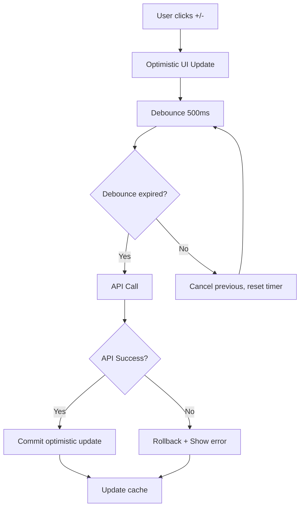

<!-- b24ac84c-8c5d-4c80-b2a5-d0c17f11ac26 66a9eaf0-d315-44b3-8089-e739852edd62 -->

# Upgrade Cart với Debounce và Optimistic Updates

## Tổng quan

Nâng cấp cart system để tối ưu performance và UX bằng cách:

- Thêm debounce cho quantity updates (tránh quá nhiều API calls)
- Sử dụng optimistic updates với React Query để UI phản hồi ngay lập tức
- Cải thiện UX cho quantity controls và delete actions
- Thêm loading states và error handling tốt hơn

## Kiến trúc

### Data Flow với Optimistic Updates



### Component Structure

```
apps/web/src/
├── lib/
│   ├── api/
│   │   └── hooks/
│   │       └── use-cart.ts (upgrade với optimistic updates)
│   └── hooks/
│       └── use-debounce.ts (new - debounce utility)
└── app/
    └── cart/
        └── CartContent.tsx (update để sử dụng new hooks)
```

## Implementation Plan

### 1. Tạo Debounce Hook

**File**: `apps/web/src/lib/hooks/use-debounce.ts`

- Tạo custom hook `useDebounce` để debounce values
- Tạo `useDebouncedCallback` để debounce function calls
- Default delay: 500ms (có thể config)
- Type-safe với TypeScript generics

### 2. Upgrade Cart Hooks với Optimistic Updates

**File**: `apps/web/src/lib/api/hooks/use-cart.ts`

#### 2.1. Update `useUpdateCartItem` hook

- Thêm optimistic update với `onMutate`
- Sử dụng `useDebouncedCallback` để debounce API calls
- Rollback optimistic update nếu API fails
- Update cache với `setQueryData` thay vì `invalidateQueries` (faster)
- Handle race conditions (cancel previous requests)

#### 2.2. Update `useRemoveFromCart` hook

- Thêm optimistic update (remove item ngay lập tức)
- Rollback nếu API fails
- Show toast success/error

#### 2.3. Tạo `useOptimisticCart` hook (optional)

- Wrapper hook để manage optimistic state
- Centralized optimistic update logic
- Reusable cho các cart operations

### 3. Update CartContent Component

**File**: `apps/web/src/app/cart/CartContent.tsx`

#### 3.1. Quantity Controls

- Sử dụng debounced update hook
- Show optimistic quantity ngay lập tức
- Disable controls trong thời gian debounce (optional)
- Show loading indicator khi đang sync với server

#### 3.2. Delete Functionality

- Optimistic remove (item biến mất ngay)
- Undo functionality (optional - có thể thêm sau)
- Better error handling với rollback

#### 3.3. Edit Functionality

- Hiện tại chưa có edit (chỉ có update quantity)
- Có thể thêm edit size/options trong tương lai
- Focus vào quantity và delete cho bây giờ

### 4. Update QuantitySelector Component (nếu cần)

**File**: `apps/web/src/components/shop/QuantitySelector.tsx`

- Có thể cần thêm prop `isPending` để show loading state
- Hoặc giữ nguyên và handle loading ở CartContent level

## Technical Details

### Debounce Strategy

- **Delay**: 500ms cho quantity updates (balance giữa UX và performance)
- **Leading edge**: Không (chỉ trigger sau khi user dừng)
- **Trailing edge**: Có (trigger sau delay)
- **Cancel previous**: Có (nếu user click liên tục, chỉ trigger lần cuối)

### Optimistic Update Strategy

- **Quantity Update**:
  - Optimistic: Update quantity ngay trong cache
  - On success: Commit (giữ nguyên)
  - On error: Rollback + show error toast

- **Remove Item**:
  - Optimistic: Remove item khỏi cache ngay
  - On success: Commit
  - On error: Rollback + show error toast

### Cache Management

- Sử dụng `queryClient.setQueryData` thay vì `invalidateQueries` cho faster updates
- Chỉ invalidate khi cần thiết (ví dụ: sau khi add new item)
- Optimistic updates không invalidate, chỉ update cache directly

### Error Handling

- Rollback optimistic updates khi API fails
- Show error toast với message rõ ràng
- Maintain UI consistency (không bị flicker)

## Files to Modify

1. **Create**: `apps/web/src/lib/hooks/use-debounce.ts`
2. **Modify**: `apps/web/src/lib/api/hooks/use-cart.ts`
3. **Modify**: `apps/web/src/app/cart/CartContent.tsx`
4. **Optional Modify**: `apps/web/src/components/shop/QuantitySelector.tsx`

## Testing Considerations

- Test debounce: Click nhanh nhiều lần, chỉ trigger 1 API call
- Test optimistic updates: UI update ngay, rollback nếu error
- Test race conditions: Multiple rapid clicks
- Test error scenarios: Network errors, validation errors
- Test edge cases: Quantity = 0, quantity > stock, etc.

## Performance Benefits

- **Reduced API calls**: Debounce giảm số lượng API calls khi user click nhanh
- **Faster UI**: Optimistic updates làm UI phản hồi ngay lập tức
- **Better UX**: User thấy feedback ngay, không phải chờ server
- **Smoother experience**: Ít loading states, ít flicker

## UX Improvements

- Instant feedback khi thay đổi quantity
- Smooth transitions (không bị jump)
- Clear error messages với rollback
- Loading states chỉ khi cần thiết

### To-dos

- [ ] Tạo useDebounce và useDebouncedCallback hooks trong apps/web/src/lib/hooks/use-debounce.ts
- [ ] Upgrade useUpdateCartItem với optimistic updates và debounce trong use-cart.ts
- [ ] Upgrade useRemoveFromCart với optimistic updates trong use-cart.ts
- [ ] Update CartContent component để sử dụng new hooks với optimistic updates
- [ ] Test debounce behavior, optimistic updates, error handling và polish UX
