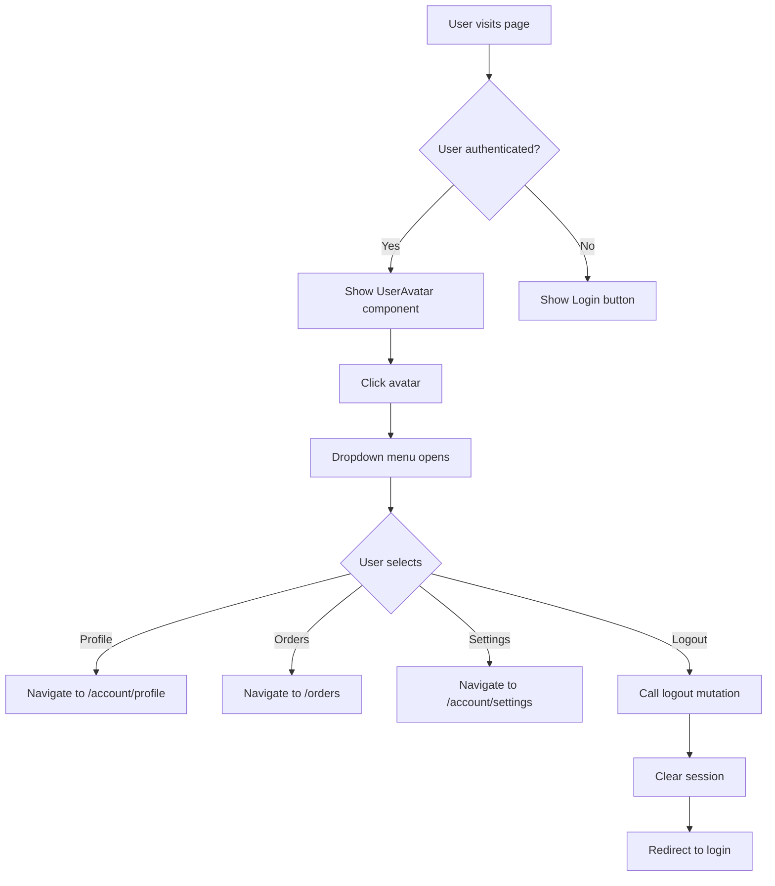

<!-- 0e7aa45b-af86-4f36-b328-b0fd935283d5 bcbed74e-2636-40d0-a511-05e59d891d15 -->

# Kế hoạch: Thay đổi Header với Avatar và User Dropdown

## Tổng quan

Sửa đổi các header components để hiển thị avatar với dropdown menu khi user đã đăng nhập, thay thế các nút "Đăng nhập" và "Đăng ký". Khi chưa đăng nhập, vẫn hiển thị nút đăng nhập như cũ.

## Các file cần thay đổi

### 1. Cài đặt shadcn/ui components

- **File**: `apps/web/components.json` (đã có)
- **Action**: Cài đặt các components từ shadcn/ui:
  - `dropdown-menu` - Cho dropdown menu
  - `avatar` - Cho avatar component
- **Command**: `npx shadcn@latest add dropdown-menu avatar`

### 2. Tạo UserAvatar component

- **File mới**: `apps/web/src/components/wds/UserAvatar.tsx`
- **Mục đích**: Component hiển thị avatar với dropdown menu
- **Features**:
  - Hiển thị avatar từ `user.avatar` nếu có
  - Fallback: Hiển thị initials (chữ cái đầu của `fullName` hoặc email)
  - Dropdown menu với các mục:
    - Hồ sơ (link đến `/account/profile` hoặc `/profile`)
    - Đơn hàng (link đến `/orders`)
    - Cài đặt (link đến `/account/settings` hoặc `/settings`)
    - Đăng xuất (gọi `useLogout()` hook)
  - Responsive: Ẩn text trên mobile, chỉ hiển thị avatar
  - Support cả dark và light theme

### 3. Sửa đổi Navbar component

- **File**: `apps/web/src/components/Navbar.tsx`
- **Thay đổi**:
  - Import `useCurrentUser` từ `@/lib/api/hooks/use-auth`
  - Import `UserAvatar` component
  - Thay thế phần login button (dòng 160-191) bằng conditional rendering:
    - Nếu `user` tồn tại: Hiển thị `UserAvatar`
    - Nếu không: Hiển thị nút "Đăng nhập" như cũ
  - Cập nhật mobile menu (dòng 312-332) với logic tương tự

### 4. Sửa đổi WDSHeader component

- **File**: `apps/web/src/components/wds/Header.tsx`
- **Thay đổi**:
  - Import `useCurrentUser` từ `@/lib/api/hooks/use-auth`
  - Import `UserAvatar` component
  - Thay thế nút "Đăng nhập" (dòng 69-74) bằng conditional rendering tương tự Navbar

### 5. Tạo utility function cho avatar initials

- **File mới**: `apps/web/src/lib/utils/avatar.ts`
- **Mục đích**: Helper function để tạo initials từ `fullName` hoặc `email`
- **Logic**:
  - Nếu có `fullName`: Lấy chữ cái đầu của từ đầu tiên và từ cuối cùng
  - Nếu không có `fullName` nhưng có `email`: Lấy chữ cái đầu của email
  - Trả về string uppercase (ví dụ: "Nguyễn Văn A" → "NA", "user@example.com" → "U")

## Chi tiết implementation

### UserAvatar Component Structure

```typescript
'use client';

import { useCurrentUser, useLogout } from '@/lib/api/hooks/use-auth';
import { DropdownMenu, DropdownMenuContent, DropdownMenuItem, DropdownMenuTrigger } from '@/components/ui/dropdown-menu';
import { Avatar, AvatarFallback, AvatarImage } from '@/components/ui/avatar';
import { getAvatarInitials } from '@/lib/utils/avatar';
import Link from 'next/link';
import { useRouter } from 'next/navigation';

interface UserAvatarProps {
  variant?: 'dark' | 'light';
}

export function UserAvatar({ variant = 'light' }: UserAvatarProps) {
  const { data: user } = useCurrentUser();
  const logout = useLogout();
  const router = useRouter();

  if (!user) return null;

  const initials = getAvatarInitials(user.fullName, user.email);
  const isDark = variant === 'dark';

  const handleLogout = () => {
    logout.mutate();
  };

  return (
    <DropdownMenu>
      <DropdownMenuTrigger asChild>
        <button className="...">
          <Avatar>
            <AvatarImage src={user.avatar || undefined} />
            <AvatarFallback>{initials}</AvatarFallback>
          </Avatar>
        </button>
      </DropdownMenuTrigger>
      <DropdownMenuContent align="end">
        <DropdownMenuItem asChild>
          <Link href="/account/profile">Hồ sơ</Link>
        </DropdownMenuItem>
        <DropdownMenuItem asChild>
          <Link href="/orders">Đơn hàng</Link>
        </DropdownMenuItem>
        <DropdownMenuItem asChild>
          <Link href="/account/settings">Cài đặt</Link>
        </DropdownMenuItem>
        <DropdownMenuItem onClick={handleLogout}>
          Đăng xuất
        </DropdownMenuItem>
      </DropdownMenuContent>
    </DropdownMenu>
  );
}
```

### Avatar Initials Utility

```typescript
export function getAvatarInitials(
  fullName: string | null,
  email: string
): string {
  if (fullName) {
    const parts = fullName.trim().split(/\s+/);
    if (parts.length >= 2) {
      // Lấy chữ cái đầu của từ đầu và từ cuối
      return (parts[0][0] + parts[parts.length - 1][0]).toUpperCase();
    }
    // Nếu chỉ có một từ, lấy 2 chữ cái đầu
    return fullName.substring(0, 2).toUpperCase();
  }

  // Fallback về email
  return email[0].toUpperCase();
}
```

## Flow diagram



## Testing checklist

- [ ] Avatar hiển thị đúng khi user đã đăng nhập
- [ ] Initials hiển thị đúng khi không có avatar
- [ ] Dropdown menu mở/đóng đúng cách
- [ ] Các links trong dropdown hoạt động
- [ ] Logout hoạt động và redirect đúng
- [ ] Responsive trên mobile (avatar vẫn hiển thị)
- [ ] Dark theme và light theme đều hoạt động
- [ ] Loading state khi đang fetch user data
- [ ] Fallback khi user data không load được

## Lưu ý

- Cần đảm bảo các routes `/account/profile`, `/orders`, `/account/settings` tồn tại hoặc tạo placeholder pages
- UserAvatar component sẽ tự động ẩn nếu `user` là `null` hoặc `undefined`
- Cần handle loading state khi `useCurrentUser()` đang fetch data
- Import order phải tuân thủ simple-import-sort (side effects → node → external → relative)

### To-dos

- [ ] Cài đặt shadcn/ui components: dropdown-menu và avatar
- [ ] Tạo utility function getAvatarInitials trong apps/web/src/lib/utils/avatar.ts
- [ ] Tạo UserAvatar component với dropdown menu (Profile, Orders, Settings, Logout)
- [ ] Cập nhật Navbar component để sử dụng UserAvatar khi user đã đăng nhập
- [ ] Cập nhật WDSHeader component để sử dụng UserAvatar khi user đã đăng nhập
- [ ] Test tất cả các trường hợp: logged in, logged out, mobile, dark/light theme
