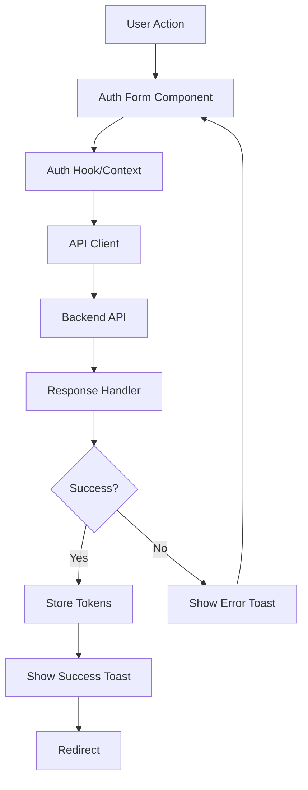

# Kế hoạch triển khai Login, Register và Verify Email trên Frontend

## Tổng quan

Triển khai đầy đủ authentication flow trên frontend với:

- Login với email/password và remember me
- Register với validation đầy đủ
- Verify email với token từ URL
- Sonner notifications cho tất cả trạng thái (success, error, loading)
- Token management và auth context
- Proper error handling và redirects

## Kiến trúc



## Các bước triển khai

### 1. Setup Dependencies

**File**: `apps/web/package.json`

- Cài đặt `sonner` cho toast notifications
- Cài đặt `axios` cho API client (nếu chưa có)

### 2. Environment Configuration

**File**: `apps/web/.env.local` (tạo nếu chưa có)

- Thêm `NEXT_PUBLIC_API_URL` cho backend API base URL

### 3. API Client Setup

**File mới**: `apps/web/src/lib/api-client.ts`

- Tạo axios instance với base URL từ env
- Setup interceptors cho request/response
- Handle token injection vào headers
- Handle error responses

**File mới**: `apps/web/src/lib/api/auth.api.ts`

- `register(email, password, fullName, phone?)` - POST /auth/register
- `login(email, password, rememberMe?)` - POST /auth/login
- `verifyEmail(token)` - GET /auth/verify-email?token=xxx
- Type definitions cho request/response

### 4. Type Definitions

**File mới**: `apps/web/src/types/auth.types.ts`

- `LoginRequest`, `LoginResponse`
- `RegisterRequest`, `RegisterResponse`
- `VerifyEmailResponse`
- `User` type matching backend UserResponseDto

### 5. Auth Context & Hooks

**File mới**: `apps/web/src/contexts/auth.context.tsx`

- AuthContext với state: user, tokens, isAuthenticated
- Token storage (localStorage)
- Auth methods: login, register, logout, verifyEmail
- Auto token refresh logic (optional, có thể làm sau)

**File mới**: `apps/web/src/hooks/use-auth.ts`

- Custom hook để sử dụng AuthContext
- Expose: `login`, `register`, `logout`, `verifyEmail`, `user`, `isAuthenticated`

### 6. Sonner Setup

**File**: `apps/web/src/app/layout.tsx` hoặc root layout

- Import và render `<Toaster />` component từ sonner
- Configure position, theme (dark mode compatible)

### 7. Update Login Page

**File**: `apps/web/src/app/auth/login/page.tsx`

- Thêm password field (hiện tại chỉ có email)
- Thêm remember me checkbox
- Integrate với `useAuth` hook
- Add form validation
- Show Sonner notifications:
  - Success: "Đăng nhập thành công" → redirect
  - Error: Hiển thị error message từ API
  - Loading: Disable form during request
- Handle 2FA case (nếu `requires2FA: true`, redirect đến 2FA page - có thể làm sau)

### 8. Update Signup Page

**File**: `apps/web/src/app/auth/signup/page.tsx`

- Thay đổi firstName/lastName thành fullName (match backend)
- Thêm password field với validation (min 8 chars)
- Thêm confirm password field
- Thêm phone field (optional)
- Integrate với `useAuth` hook
- Add form validation
- Show Sonner notifications:
  - Success: "Đăng ký thành công! Vui lòng kiểm tra email để xác thực"
  - Error: Hiển thị error message từ API
  - Loading: Disable form during request
- Redirect sau khi register thành công (có thể redirect đến verify-email page với message)

### 9. Create Verify Email Page

**File mới**: `apps/web/src/app/auth/verify-email/page.tsx`

- Server Component để đọc token từ query params
- Client Component để handle verification
- Integrate với `useAuth` hook
- Show Sonner notifications:
  - Success: "Email đã được xác thực thành công!" → redirect to login
  - Error: "Token không hợp lệ hoặc đã hết hạn"
  - Loading: Show loading state
- Handle cases:
  - No token: Show error
  - Invalid token: Show error
  - Already verified: Show info message

**File mới**: `apps/web/src/app/auth/verify-email/layout.tsx`

- Metadata cho verify-email page

### 10. Error Handling

**File**: `apps/web/src/lib/api-client.ts`

- Map HTTP status codes to Vietnamese error messages
- Handle network errors
- Handle validation errors (400, 409, etc.)
- Extract error messages từ API response

### 11. Token Management

**File**: `apps/web/src/contexts/auth.context.tsx`

- Store accessToken và refreshToken trong localStorage
- Auto-inject token vào API requests
- Clear tokens on logout
- Handle token expiration (có thể làm sau)

### 12. Redirects & Navigation

- After successful login: redirect to `/` hoặc previous page
- After successful register: redirect to `/auth/verify-email` với message
- After successful verify: redirect to `/auth/login` với success message
- Handle protected routes (có thể làm sau với middleware)

## Files cần tạo/sửa đổi

### Files mới:

1. `apps/web/src/lib/api-client.ts` - API client setup
2. `apps/web/src/lib/api/auth.api.ts` - Auth API functions
3. `apps/web/src/types/auth.types.ts` - Type definitions
4. `apps/web/src/contexts/auth.context.tsx` - Auth context
5. `apps/web/src/hooks/use-auth.ts` - Auth hook
6. `apps/web/src/app/auth/verify-email/page.tsx` - Verify email page
7. `apps/web/src/app/auth/verify-email/layout.tsx` - Verify email layout

### Files cần sửa:

1. `apps/web/package.json` - Add sonner và axios
2. `apps/web/src/app/auth/login/page.tsx` - Wire up login
3. `apps/web/src/app/auth/signup/page.tsx` - Wire up register
4. `apps/web/src/app/layout.tsx` - Add Sonner Toaster

## Chi tiết implementation

### API Client Structure

```typescript
// api-client.ts
- Axios instance với baseURL từ NEXT_PUBLIC_API_URL
- Request interceptor: inject token từ localStorage
- Response interceptor: handle errors, extract messages
- Error handler: map status codes to Vietnamese messages
```

### Auth Context Structure

```typescript
// auth.context.tsx
- State: { user, accessToken, refreshToken, isAuthenticated }
- Methods: login(), register(), logout(), verifyEmail()
- Token storage: localStorage với keys 'accessToken', 'refreshToken'
- Auto-load tokens on mount
```

### Form Validation

- Email: valid email format
- Password: min 8 characters (register)
- Full name: required, non-empty
- Confirm password: match password (register)
- Phone: optional, validate format if provided

### Sonner Notifications

- Success: `toast.success(message)`
- Error: `toast.error(message)`
- Loading: `toast.loading(message)` hoặc disable form
- Auto-dismiss sau 3-5 giây (configurable)

## Testing Checklist

- [ ] Login với valid credentials → success toast + redirect
- [ ] Login với invalid credentials → error toast
- [ ] Login với unverified email → error toast với message
- [ ] Register với valid data → success toast + redirect
- [ ] Register với existing email → error toast
- [ ] Register với weak password → validation error
- [ ] Verify email với valid token → success toast + redirect
- [ ] Verify email với invalid token → error toast
- [ ] Verify email với expired token → error toast
- [ ] Verify email với already verified email → info message
- [ ] Token được lưu vào localStorage sau login
- [ ] Token được clear sau logout
- [ ] Form validation hoạt động đúng
- [ ] Loading states hiển thị đúng
- [ ] Sonner notifications hiển thị đúng theme (dark mode)

## Notes

- Backend API base URL cần được config qua `NEXT_PUBLIC_API_URL`
- Token storage sử dụng localStorage (có thể chuyển sang httpOnly cookies sau nếu cần)
- 2FA flow sẽ được implement sau (hiện tại chỉ handle `requires2FA` flag)
- Protected routes và middleware sẽ được implement sau
- Auto token refresh có thể implement sau nếu cần
