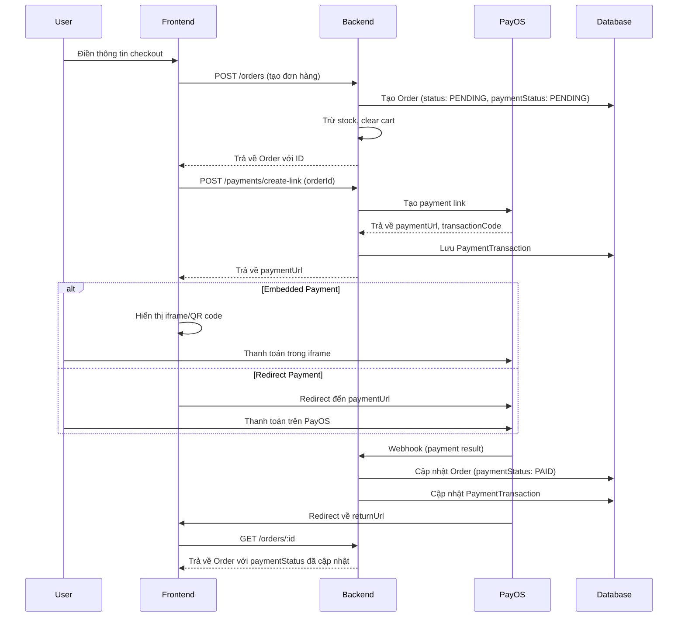

<!-- af6d1f50-27ed-4bc5-a406-00b0e49dd095 7cf8e796-754a-4bf7-bd7c-c3c3ddcb12a8 -->

# Kế hoạch tích hợp PayOS Payment Gateway

## Tổng quan

Tích hợp PayOS vào hệ thống e-commerce để xử lý thanh toán. Flow sẽ bao gồm:

1. Tạo đơn hàng (đã có sẵn)
2. Tạo payment link với PayOS
3. Xử lý thanh toán (embedded hoặc redirect)
4. Xử lý webhook từ PayOS
5. Cập nhật trạng thái đơn hàng

## Kiến trúc Flow



## Implementation Plan

### Phase 1: Backend - PayOS Integration

#### 1.1 Cài đặt PayOS SDK

- **File**: `apps/api/package.json`
- Cài đặt package `@payos/node` (hoặc `payos` nếu có)
- Thêm vào dependencies

#### 1.2 Tạo PayOS Module

- **File**: `apps/api/src/payments/payments.module.ts`
- Module mới cho payment processing
- Import PayOS service và controller

#### 1.3 Tạo PayOS Service

- **File**: `apps/api/src/payments/services/payos.service.ts`
- Service để tương tác với PayOS API:
  - `createPaymentLink(orderId, amount, description, returnUrl, cancelUrl)`
  - `verifyWebhook(data, signature)`
  - `getPaymentInfo(transactionCode)`
- Sử dụng PayOS SDK hoặc axios để call API
- Environment variables: `PAYOS_CLIENT_ID`, `PAYOS_API_KEY`, `PAYOS_CHECKSUM_KEY`

#### 1.4 Cập nhật Prisma Schema

- **File**: `apps/api/prisma/schema/payment.prisma` (mới)
- Tạo model `PaymentTransaction`:

  ```prisma
  model PaymentTransaction {
    id            String   @id @default(cuid())
    orderId       String   @unique
    order         Order    @relation(fields: [orderId], references: [id], onDelete: Cascade)
    transactionCode String @unique // PayOS transaction code
    amount        Decimal  @db.Money
    status        PaymentTransactionStatus @default(PENDING)
    paymentUrl    String?  // URL để redirect
    payosData     Json?    // Lưu raw data từ PayOS
    createdAt     DateTime @default(now())
    updatedAt     DateTime @updatedAt

    @@map("payment_transactions")
  }

  enum PaymentTransactionStatus {
    PENDING
    PAID
    CANCELLED
    EXPIRED
    FAILED
  }
  ```

- Thêm relation từ Order đến PaymentTransaction

#### 1.5 Tạo Payment Commands/Queries (CQRS)

- **File**: `apps/api/src/payments/commands/create-payment-link/create-payment-link.command.ts`
- **File**: `apps/api/src/payments/commands/create-payment-link/create-payment-link.handler.ts`
- Command để tạo payment link:
  - Validate order exists và chưa thanh toán
  - Gọi PayOS service để tạo link
  - Lưu PaymentTransaction vào database
  - Trả về paymentUrl

#### 1.6 Tạo Payment Controller

- **File**: `apps/api/src/payments/payments.controller.ts`
- Endpoints:
  - `POST /payments/create-link` - Tạo payment link cho order
  - `POST /payments/webhook` - Nhận webhook từ PayOS (public, không cần auth)
  - `GET /payments/verify/:transactionCode` - Verify payment status

#### 1.7 Xử lý Webhook

- **File**: `apps/api/src/payments/commands/process-payment-webhook/process-payment-webhook.handler.ts`
- Xử lý webhook từ PayOS:
  - Verify signature với Checksum Key
  - Cập nhật PaymentTransaction status
  - Cập nhật Order paymentStatus (PENDING → PAID)
  - Cập nhật Order status (PENDING → CONFIRMED) nếu payment thành công
  - Restore stock nếu payment failed/cancelled

#### 1.8 Cập nhật Order Creation Flow

- **File**: `apps/api/src/orders/commands/create-order/create-order.command.ts`
- Thêm field `orderType` để phân biệt 2 loại:
  - `FROM_CART`: Mua từ giỏ hàng (hiện tại)
  - `DIRECT_PURCHASE`: Mua trực tiếp sản phẩm (Buy Now)
- Thêm optional fields cho direct purchase:
  - `productId?: string`
  - `productSlug?: ProductSlug`
  - `size?: ProductSize`
  - `quantity?: number`

- **File**: `apps/api/src/orders/commands/create-order/create-order.handler.ts`
- Cập nhật handler để xử lý cả 2 loại:
  - **FROM_CART**: Logic hiện tại (lấy từ cart, clear cart sau khi tạo)
  - **DIRECT_PURCHASE**:
    - Validate product exists
    - Check stock (với size nếu có)
    - Tạo order items trực tiếp từ product
    - Không clear cart (vì không dùng cart)
- Check pending orders trước khi tạo:
  - Query orders với `status: PENDING`, `paymentStatus: PENDING`, `userId`
  - Nếu có pending order → throw ConflictException
  - Hoặc return existing pending order (tùy chọn)
- Order vẫn được tạo với `paymentStatus: PENDING`
- Payment link sẽ được tạo riêng sau khi order được tạo

### Phase 2: Frontend - Payment UI

#### 2.1 Cập nhật Checkout Page

- **File**: `apps/web/src/app/checkout/page.tsx`
- Check pending orders trước khi cho phép tạo order mới:
  - Query API để check xem user có pending order không
  - Nếu có → redirect đến payment page của order đó
  - Nếu không → cho phép tạo order mới
- Sau khi tạo order thành công:
  - Lưu orderId vào localStorage/sessionStorage
  - Gọi API tạo payment link
  - Redirect đến payment page hoặc hiển thị payment UI

#### 2.2 Tạo Payment Page

- **File**: `apps/web/src/app/payments/[orderId]/page.tsx`
- Page hiển thị payment options:
  - Embedded payment (iframe hoặc QR code)
  - Button "Thanh toán với PayOS" (redirect)
  - Hiển thị thông tin đơn hàng
  - Polling để check payment status

#### 2.3 Tạo Payment Components

- **File**: `apps/web/src/components/shop/PaymentEmbedded.tsx` (mới)
  - Component hiển thị embedded payment (iframe)
  - Xử lý payment success/failure trong iframe

- **File**: `apps/web/src/components/shop/PaymentQRCode.tsx` (mới)
  - Component hiển thị QR code từ PayOS
  - Polling để check payment status

#### 2.4 Tạo Payment Hooks

- **File**: `apps/web/src/lib/api/hooks/use-payments.ts` (mới)
- Hooks:
  - `useCreatePaymentLink(orderId)`
  - `useVerifyPayment(transactionCode)`

#### 2.5 Cập nhật Order Detail Page

- **File**: `apps/web/src/app/orders/[id]/page.tsx`
- Hiển thị payment status
- Nếu `paymentStatus === 'PENDING'`:
  - Hiển thị button "Thanh toán ngay"
  - Redirect đến payment page
- Nếu `paymentStatus === 'PAID'`:
  - Hiển thị badge "Đã thanh toán"
  - Ẩn cancel button

#### 2.6 Xử lý Payment Return/Cancel

- **File**: `apps/web/src/app/payments/return/page.tsx` (mới)
- Xử lý khi PayOS redirect về:
  - Verify payment status
  - Redirect đến order detail page với success message
- **File**: `apps/web/src/app/payments/cancel/page.tsx` (mới)
- Xử lý khi user cancel payment:
  - Hiển thị thông báo
  - Redirect về order detail page

### Phase 3: Environment & Configuration

#### 3.1 Environment Variables

- **Backend** (`apps/api/.env`):

  ```
  PAYOS_CLIENT_ID=your_client_id
  PAYOS_API_KEY=your_api_key
  PAYOS_CHECKSUM_KEY=your_checksum_key
  PAYOS_RETURN_URL=https://yourdomain.com/payments/return
  PAYOS_CANCEL_URL=https://yourdomain.com/payments/cancel
  ```

- **Frontend** (`apps/web/.env.local`):
  ```
  NEXT_PUBLIC_PAYOS_ENABLED=true
  NEXT_PUBLIC_SITE_URL=https://yourdomain.com
  ```

#### 3.2 API Client Updates

- **File**: `apps/web/src/lib/api/orders.ts`
- Thêm function `createPaymentLink(orderId)`
- **File**: `apps/web/src/lib/api/payments.ts` (mới)
- API client cho payment endpoints

## Database Migration

1. Tạo migration cho `PaymentTransaction` model
2. Chạy migration: `cd apps/api && pnpm prisma:migrate`

## Testing Checklist

- [ ] Tạo payment link thành công
- [ ] Webhook được xử lý đúng
- [ ] Order status được cập nhật sau khi thanh toán
- [ ] Stock được restore ngay khi payment failed (webhook)
- [ ] Stock được restore tự động sau 15 phút nếu chưa thanh toán (cron job)
- [ ] Cron job không expire orders đã thanh toán
- [ ] Expire order là idempotent (không restore stock 2 lần)
- [ ] Embedded payment hoạt động
- [ ] Redirect payment hoạt động
- [ ] Return/Cancel URLs hoạt động đúng
- [ ] Payment verification hoạt động

## Security Considerations

1. **Webhook Verification**: Luôn verify signature từ PayOS
2. **Idempotency**: Xử lý duplicate webhook calls
3. **Transaction Safety**: Sử dụng database transactions cho payment updates
4. **Error Handling**: Xử lý lỗi từ PayOS API gracefully
5. **Logging**: Log tất cả payment transactions để audit

## Files to Create/Modify

### Backend (NestJS)

- `apps/api/src/payments/payments.module.ts` (mới)
- `apps/api/src/payments/payments.controller.ts` (mới)
- `apps/api/src/payments/services/payos.service.ts` (mới)
- `apps/api/src/payments/commands/create-payment-link/` (mới)
- `apps/api/src/payments/commands/process-payment-webhook/` (mới)
- `apps/api/src/payments/infrastructure/payment.repository.ts` (mới)
- `apps/api/src/payments/dtos/payment.dto.ts` (mới)
- `apps/api/prisma/schema/payment.prisma` (mới)
- `apps/api/package.json` (update - thêm PayOS SDK)

### Frontend (Next.js)

- `apps/web/src/app/payments/[orderId]/page.tsx` (mới)
- `apps/web/src/app/payments/return/page.tsx` (mới)
- `apps/web/src/app/payments/cancel/page.tsx` (mới)
- `apps/web/src/components/shop/PaymentEmbedded.tsx` (mới)
- `apps/web/src/components/shop/PaymentQRCode.tsx` (mới)
- `apps/web/src/lib/api/hooks/use-payments.ts` (mới)
- `apps/web/src/lib/api/payments.ts` (mới)
- `apps/web/src/app/checkout/page.tsx` (update)
- `apps/web/src/app/orders/[id]/page.tsx` (update)

### Phase 4: Auto Stock Restoration (15 minutes timeout)

#### 4.1 Cài đặt NestJS Schedule

- **File**: `apps/api/package.json`
- Cài đặt `@nestjs/schedule` package
- Module để chạy scheduled tasks/cron jobs

#### 4.2 Tạo Expire Order Command

- **File**: `apps/api/src/orders/commands/expire-order/expire-order.command.ts`
- **File**: `apps/api/src/orders/commands/expire-order/expire-order.handler.ts`
- Command để expire order và restore stock:
  - Check order status là PENDING và paymentStatus là PENDING
  - Restore stock (tương tự CancelOrderHandler)
  - Update order status → CANCELLED
  - Update paymentStatus → FAILED (nếu có PaymentTransaction)
  - Idempotent: không restore stock nếu đã restore rồi (check order status)

#### 4.3 Tạo Scheduled Job

- **File**: `apps/api/src/orders/schedulers/order-expiration.scheduler.ts`
- Scheduled task chạy mỗi 1-2 phút:
  - Query tất cả orders với:
    - `status: PENDING`
    - `paymentStatus: PENDING`
    - `createdAt < now() - 15 minutes`
  - Dispatch ExpireOrderCommand cho mỗi expired order
  - Log expired orders để audit

#### 4.4 Cập nhật Payment Webhook Handler

- **File**: `apps/api/src/payments/commands/process-payment-webhook/process-payment-webhook.handler.ts`
- Khi payment failed/cancelled:
  - Restore stock ngay lập tức
  - Update order status → CANCELLED
  - Update paymentStatus → FAILED

#### 4.5 Cập nhật Order Repository

- **File**: `apps/api/src/orders/infrastructure/order.repository.ts`
- Thêm method `findExpiredPendingOrders()`:
  - Query orders chưa thanh toán sau 15 phút
  - Sử dụng Prisma query với `createdAt` filter

#### 4.6 Cập nhật Orders Module

- **File**: `apps/api/src/orders/orders.module.ts`
- Import `ScheduleModule` từ `@nestjs/schedule`
- Register `OrderExpirationScheduler`

### Phase 5: Crash Recovery & Resilience

#### 5.1 Database Transaction Safety

- **File**: `apps/api/src/orders/commands/create-order/create-order.handler.ts`
- Wrap order creation trong Prisma transaction:
  - Tạo order và order items trong transaction
  - Nếu transaction fail → rollback, không trừ stock
  - Đảm bảo atomicity: hoặc tất cả thành công, hoặc tất cả rollback

- **File**: `apps/api/src/orders/commands/expire-order/expire-order.handler.ts`
- Wrap stock restoration trong transaction:
  - Check order status trước khi restore (idempotent)
  - Restore stock và update order trong cùng transaction
  - Nếu fail → rollback, không partial update

#### 5.2 Recovery Job on Startup

- **File**: `apps/api/src/orders/schedulers/order-recovery.scheduler.ts`
- Job chạy khi app startup và định kỳ:
  - Tìm orders "stuck" trong trạng thái PENDING:
    - `status: PENDING`
    - `paymentStatus: PENDING`
    - `createdAt < now() - 15 minutes`
    - Không có PaymentTransaction hoặc PaymentTransaction status là PENDING/EXPIRED
  - Dispatch ExpireOrderCommand cho các orders này
  - Log recovery actions

#### 5.3 Idempotent Operations

- **File**: `apps/api/src/orders/commands/expire-order/expire-order.handler.ts`
- Đảm bảo idempotency:
  - Check order status trước khi restore stock
  - Nếu order đã CANCELLED hoặc paymentStatus đã PAID → skip
  - Sử dụng database lock để tránh race condition

- **File**: `apps/api/src/payments/commands/process-payment-webhook/process-payment-webhook.handler.ts`
- Idempotent webhook processing:
  - Check PaymentTransaction status trước khi update
  - Nếu đã xử lý rồi → return success (không duplicate processing)
  - Sử dụng transaction code làm unique identifier

#### 5.4 Health Check & Monitoring

- **File**: `apps/api/src/health/health.controller.ts` (mới hoặc update)
- Health check endpoint:
  - Check database connection
  - Check số lượng orders stuck (PENDING > 15 phút)
  - Alert nếu có nhiều orders stuck

#### 5.5 Graceful Shutdown

- **File**: `apps/api/src/main.ts`
- Implement graceful shutdown:
  - Listen to SIGTERM/SIGINT signals
  - Đợi các transactions đang chạy hoàn thành
  - Close database connections gracefully
  - Log shutdown events

#### 5.6 Payment Transaction Cleanup

- **File**: `apps/api/src/payments/schedulers/payment-cleanup.scheduler.ts`
- Scheduled job để cleanup:
  - Tìm PaymentTransactions expired (PENDING > 15 phút)
  - Update status → EXPIRED
  - Trigger order expiration nếu cần

#### 5.7 Error Handling & Logging

- **File**: `apps/api/src/common/filters/global-exception.filter.ts` (update hoặc mới)
- Global exception filter:
  - Log tất cả errors với context (orderId, userId, etc.)
  - Không expose sensitive data
  - Alert cho critical errors (payment failures, stock issues)

- **File**: `apps/api/src/orders/commands/create-order/create-order.handler.ts`
- Error handling:
  - Nếu stock deduction fail → rollback transaction
  - Nếu order creation fail → không trừ stock
  - Log errors với đầy đủ context

## Notes

1. **Payment Link Creation**: Tạo payment link ngay sau khi order được tạo, không tạo trong order creation handler để tách biệt concerns
2. **Order Code vs Transaction Code**:
   - Order code: `#ORD-1234` (internal)
   - Transaction code: PayOS transaction code (external)

3. **Payment Status Flow**:
   - Order created → `paymentStatus: PENDING`
   - Payment link created → `PaymentTransaction` created
   - Payment successful → `paymentStatus: PAID`, `status: CONFIRMED`
   - Payment failed/cancelled → `paymentStatus: FAILED`, restore stock immediately
   - Order expired (15 min) → `status: CANCELLED`, `paymentStatus: FAILED`, restore stock

4. **Webhook Security**: PayOS sẽ gửi webhook với signature, cần verify trước khi xử lý
5. **Polling**: Frontend có thể polling payment status nếu cần (cho embedded payment)
6. **Stock Restoration**:
   - Immediate: Khi payment failed/cancelled qua webhook
   - Scheduled: Sau 15 phút nếu order vẫn PENDING (cron job)
   - Manual: Khi user cancel order
   - Idempotent: Không restore stock nếu đã restore (check order status)

7. **Order Expiration**:
   - Cron job chạy mỗi 1-2 phút để check expired orders
   - Chỉ expire orders với `status: PENDING` và `paymentStatus: PENDING`
   - Không expire nếu order đã có payment transaction đang xử lý

8. **Crash Recovery**:
   - Database transactions đảm bảo atomicity (all or nothing)
   - Recovery job chạy khi app startup để cleanup stuck orders
   - Idempotent operations để tránh duplicate processing
   - Graceful shutdown để đợi transactions hoàn thành
   - Health checks để monitor system state

9. **Resilience Patterns**:
   - Transaction safety: Tất cả critical operations trong transactions
   - Idempotency: Operations có thể chạy nhiều lần mà không ảnh hưởng
   - Recovery: Tự động recover khi hệ thống restart
   - Monitoring: Health checks và logging để detect issues sớm

### To-dos

- [ ] Cài đặt PayOS SDK (@payos/node hoặc payos package) vào backend
- [ ] Tạo Prisma schema cho PaymentTransaction model và enum PaymentTransactionStatus
- [ ] Tạo PayOS service với methods: createPaymentLink, verifyWebhook, getPaymentInfo
- [ ] Tạo payments module với CQRS commands/queries cho payment operations
- [ ] Tạo payments controller với endpoints: create-link, webhook, verify
- [ ] Implement webhook handler để xử lý payment callbacks từ PayOS và cập nhật order status
- [ ] Cập nhật checkout page để tạo payment link sau khi order được tạo
- [ ] Tạo payment page với embedded payment và redirect options
- [ ] Tạo PaymentEmbedded và PaymentQRCode components
- [ ] Cập nhật order detail page để hiển thị payment status và payment button
- [ ] Tạo return/cancel pages để xử lý redirect từ PayOS
- [ ] Thêm PayOS environment variables vào backend và frontend configs
