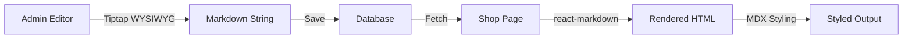

<!-- 4efd722a-4ca4-48a8-8a03-60cc6671812c 845868cb-8eb6-4488-9810-e1fa1a7e75ef -->

# Tiptap + react-markdown Integration Plan

## Overview

Replace the plain textarea in ProductEditor with Tiptap WYSIWYG editor that exports markdown, and replace plain text rendering in ProductInfo with react-markdown renderer that reuses MDX component styling.

## Architecture Flow



## Implementation Steps

### Phase 1: Install Dependencies

Install required packages in `apps/web`:

```bash
pnpm add @tiptap/react @tiptap/starter-kit @tiptap/extension-markdown
pnpm add react-markdown remark-gfm rehype-raw
```

**Packages:**

- `@tiptap/react`: Core Tiptap React integration
- `@tiptap/starter-kit`: Essential extensions (bold, italic, headings, lists, etc.)
- `@tiptap/extension-markdown`: Markdown import/export support
- `react-markdown`: Markdown to React renderer
- `remark-gfm`: GitHub Flavored Markdown support (tables, strikethrough, etc.)
- `rehype-raw`: Allow raw HTML in markdown (optional, for security consider removing)

### Phase 2: Create Tiptap Editor Component

Create `apps/web/src/components/admin/MarkdownEditor.tsx`:

**Features:**

- Tiptap editor with starter-kit extensions
- Markdown import/export support
- Toolbar with common formatting buttons (bold, italic, headings, lists, links)
- Dark theme styling matching WDS design system
- Controlled component that works with react-hook-form
- Export markdown string on change

**Key Implementation:**

- Use `useEditor` hook from Tiptap
- Integrate with react-hook-form using `Controller`
- Export markdown using `editor.storage.markdown.getMarkdown()`
- Import markdown using `editor.commands.setContent(markdown, false, { preserveWhitespace: 'full' })`
- Style toolbar and editor to match WDS dark theme

### Phase 3: Create Markdown Renderer Component

Create `apps/web/src/components/shop/ProductDescription.tsx`:

**Features:**

- Use react-markdown to render markdown string
- Reuse styling from `mdx-components.tsx` (h1, h2, h3, p, ul, ol, li, strong, em, hr)
- Custom components for shop theme (white text on dark background)
- Support for links, images, code blocks
- Safe HTML rendering (sanitize if needed)

**Key Implementation:**

- Create `markdownComponents` object similar to `useMDXComponents`
- Map markdown elements to styled React components
- Use `remark-gfm` plugin for extended markdown features
- Style to match shop page theme (white/neutral-200 text)

### Phase 4: Update ProductEditor

Modify `apps/web/src/components/admin/ProductEditor.tsx`:

**Changes:**

- Replace textarea (lines 157-164) with MarkdownEditor component
- Use react-hook-form `Controller` to integrate Tiptap editor
- Remove `.trim()` from description in onSubmit (markdown may have intentional whitespace)
- Update placeholder text to indicate markdown support

**Integration:**

```typescript
<Controller
  name="description"
  control={control}
  render={({ field }) => (
    <MarkdownEditor
      value={field.value}
      onChange={field.onChange}
      disabled={isLoading}
    />
  )}
/>
```

### Phase 5: Update ProductInfo

Modify `apps/web/src/components/shop/ProductInfo.tsx`:

**Changes:**

- Replace plain `<p>` tag (line 83) with ProductDescription component
- Pass description string to ProductDescription
- Maintain existing layout and spacing

**Integration:**

```typescript
<ProductDescription markdown={description} />
```

### Phase 6: Styling & Theme

**Tiptap Editor Styling:**

- Toolbar: Dark background with accent color buttons
- Editor content area: Match existing textarea styling
- Focus states: Use WDS accent color
- Placeholder: Match existing placeholder styling

**Markdown Renderer Styling:**

- Reuse heading styles from `mdx-components.tsx` but adjust for shop context
- Paragraphs: `text-white/80 leading-relaxed` (shop theme)
- Links: Accent color with hover states
- Lists: Proper spacing and indentation
- Code blocks: Dark background with syntax highlighting (optional)

### Phase 7: Testing & Validation

**Test Cases:**

1. Editor: Create markdown content with various formatting
2. Editor: Save and verify markdown string in database
3. Editor: Load existing markdown content into editor
4. Renderer: Display markdown with all supported elements
5. Renderer: Verify styling matches shop theme
6. Integration: End-to-end flow from editor to shop page
7. Edge cases: Empty description, very long content, special characters

**Validation:**

- Markdown syntax is preserved in database
- Rendered output matches expected HTML
- Styling is consistent across all markdown elements
- No console errors or warnings

## Files to Create

1. `apps/web/src/components/admin/MarkdownEditor.tsx` - Tiptap editor component
2. `apps/web/src/components/shop/ProductDescription.tsx` - Markdown renderer component

## Files to Modify

1. `apps/web/src/components/admin/ProductEditor.tsx` - Replace textarea with MarkdownEditor
2. `apps/web/src/components/shop/ProductInfo.tsx` - Replace plain text with ProductDescription
3. `apps/web/package.json` - Add new dependencies (via pnpm install)

## Files to Reference (No Changes)

1. `apps/web/src/mdx-components.tsx` - Reuse styling patterns
2. `apps/api/src/products/dtos/update-product.dto.ts` - Backend already supports string description

## Backend Considerations

**No backend changes needed:**

- Backend already accepts `description` as optional string in `UpdateProductDto`
- Database schema already stores description as text
- API endpoints already return description as string

## Migration Strategy

**Backward Compatibility:**

- Existing plain text descriptions will render as-is (markdown renderer handles plain text)
- No data migration needed
- Admin can gradually convert existing descriptions to markdown

## Future Enhancements (Out of Scope)

- Image upload in editor
- Code syntax highlighting
- Table editor
- Preview mode in editor
- Markdown validation
- Character/word count

## Dependencies Impact

**New Dependencies:**

- `@tiptap/react`: ~50KB (gzipped)
- `@tiptap/starter-kit`: ~15KB (gzipped)
- `@tiptap/extension-markdown`: ~10KB (gzipped)
- `react-markdown`: ~25KB (gzipped)
- `remark-gfm`: ~15KB (gzipped)
- `rehype-raw`: ~5KB (gzipped)

**Total Impact:** ~120KB (gzipped) - acceptable for admin panel and shop pages

## Success Criteria

- [ ] Admin can edit product descriptions with rich text formatting
- [ ] Markdown is saved correctly to database
- [ ] Shop pages display formatted markdown content
- [ ] Styling matches WDS design system
- [ ] No breaking changes to existing functionality
- [ ] All markdown elements render correctly (headings, lists, links, etc.)
- [ ] Editor is accessible and keyboard navigable
- [ ] Code passes linting and type checking
